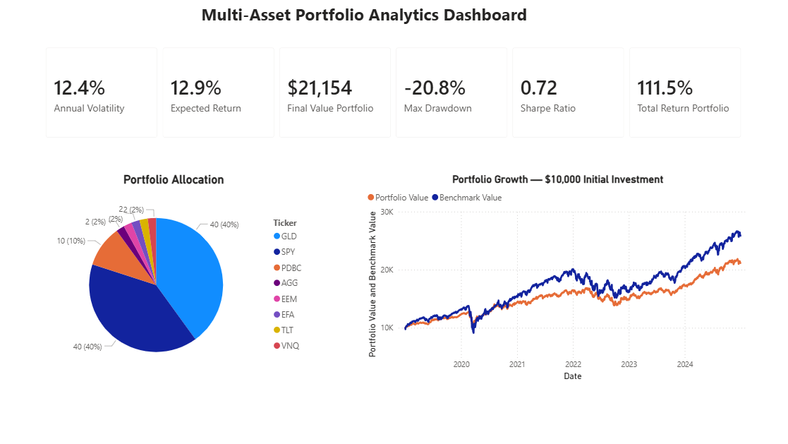
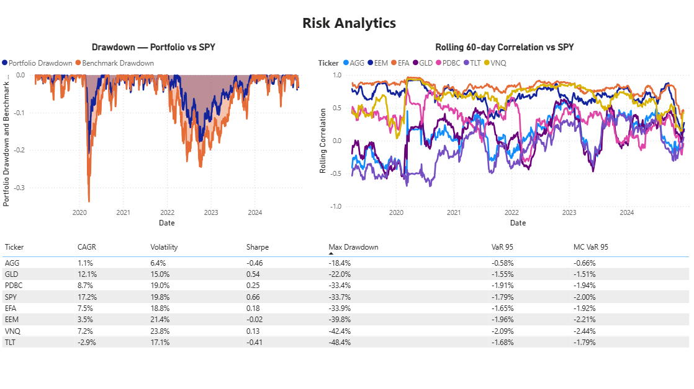
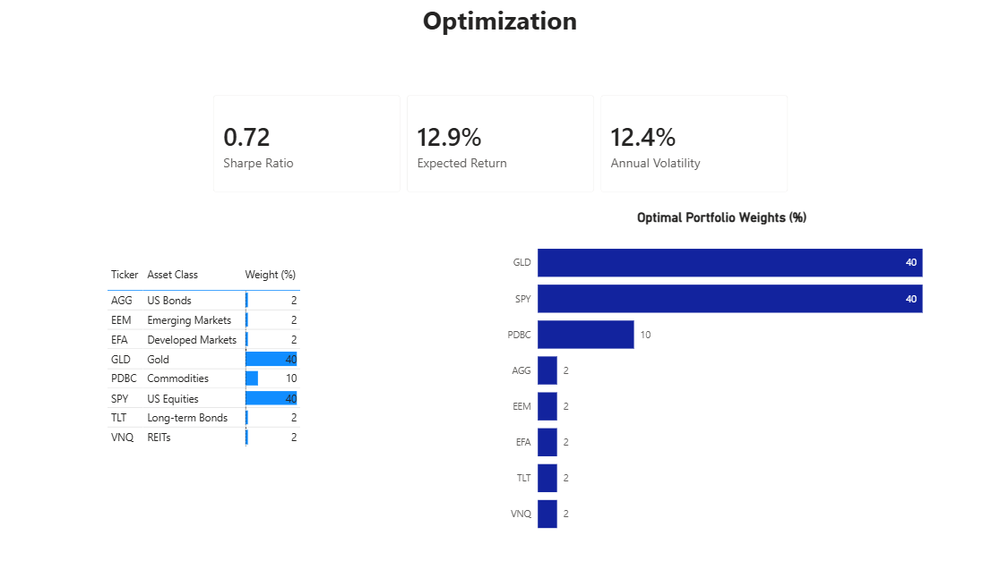

# Multi-Asset Portfolio Analytics Dashboard

## Overview
End-to-end quantitative analysis of an 8-ETF global portfolio (2019–2024).  
The project covers data collection, risk/return metrics, mean-variance optimization,  
backtesting, and an interactive Power BI dashboard emulating institutional performance reporting.

---

## Tools & Technologies
| Category | Tools |
|----------|-------|
| Data collection | Python, yfinance |
| Data analysis | pandas, numpy |
| Visualization | matplotlib, seaborn |
| Portfolio optimization | PyPortfolioOpt (cvxpy) |
| Risk modeling | Monte Carlo simulation |
| Dashboard | Power BI |
| Environment | VS Code, Jupyter Notebook |

---
## Project Structure
```
portfolio-analysis/
│
├── data/
│   ├── etf_prices.csv
│   ├── daily_returns.csv
│   └── monthly_returns.csv
│
├── outputs/
│   ├── metrics.csv
│   ├── portfolio_weights.csv
│   ├── backtest_data.csv
│   ├── correlation_long.csv
│   ├── rolling_correlation.csv
│   ├── kpi_summary.csv
│   ├── monthly_returns.csv
│   ├── daily_returns.csv
│   ├── correlation_matrix.png
│   ├── efficient_frontier.png
│   ├── efficient_frontier_comparison.png
│   ├── mc_var_spy.png
│   ├── backtest.png
│   ├── rolling_correlation
│   └── backtest_out_of_sample.png
│
├── dashboard/
│   └── portfolio_dashboard.pbix
│
├── screenshots/
│    ├── page1_portfolio_overview.png
│    ├── page2_risk_analytics.png
│    └── page3_optimization.png
│
├── portfolio_analysis.ipynb
├── requirements.txt
└── README.md

```
---

## ETF Universe
| Ticker | Asset Class | Role in Portfolio |
|--------|-------------|-------------------|
| SPY | US Equities (S&P 500) | Core growth engine |
| EFA | Developed Markets (Europe, Japan) | Geographic diversification |
| EEM | Emerging Markets | Higher risk/return |
| AGG | US Aggregate Bonds | Stabilizer |
| TLT | Long-term Treasuries | Crisis hedge |
| GLD | Gold | Inflation protection |
| VNQ | US REITs | Income + inflation hedge |
| PDBC | Commodities | Further diversification |

---

## Methodology

### Step 1 — Data Collection
- Downloaded 5 years of daily price data (2019–2024) using yfinance
- Calculated daily and monthly returns
- Verified data quality: 0 missing values across all 8 ETFs

### Step 2 — Risk & Return Metrics
Calculated the following metrics for each ETF:
- **CAGR** — Compound Annual Growth Rate
- **Annualized Volatility** — Daily std × √252
- **Sharpe Ratio** — (CAGR - risk-free rate) / Volatility, risk-free rate = 4%
- **Maximum Drawdown** — Largest peak-to-trough decline
- **Historical VaR (95%)** — 5th percentile of daily returns
- **Monte Carlo VaR (95%)** — 10,000 simulated return paths based on historical mean and volatility

### Step 3 — Portfolio Optimization
Applied Markowitz mean-variance optimization using PyPortfolioOpt:
- Computed expected returns (mean historical return) and covariance matrix
- Solved for maximum Sharpe Ratio portfolio
- Applied constraints: min 2% per ETF, max 40% per ETF (to enforce diversification)
- Plotted Efficient Frontier with and without constraints

**Optimal weights (constrained):**
| Ticker | Weight |
|--------|--------|
| GLD | 40.0% |
| SPY | 40.0% |
| PDBC | 10.0% |
| AGG, EEM, EFA, TLT, VNQ | 2.0% each |

### Step 4 — Backtesting
Two backtesting approaches implemented:

**In-sample backtest (2019–2024):**
Applied optimized weights to the full historical dataset.
Note: results are optimistic due to in-sample bias.

**Out-of-sample backtest (train: 2019–2022, test: 2023–2024):**
Weights optimized on training data only, then applied to unseen test data.
This provides a more realistic estimate of strategy performance.

### Step 5 — Rolling Correlation Analysis
Computed 60-day rolling correlation of each ETF vs SPY to identify:
- Regime changes in correlation structure
- Diversification breakdown during market stress

---

## Key Findings

### Risk/Return Summary
| Metric | Portfolio | SPY (Benchmark) |
|--------|-----------|-----------------|
| Expected Annual Return | 12.9% | 17.2% |
| Annual Volatility | 12.4% | 19.8% |
| Sharpe Ratio | 0.72 | 0.66 |
| Max Drawdown | -20.8% | -33.7% |

### Key Insights
1. **Sharpe Ratio:** Optimized portfolio achieves Sharpe of 0.72 vs SPY's 0.66 — 
   better risk-adjusted return despite lower absolute return.

2. **Drawdown reduction:** Max drawdown of -20.8% vs SPY's -33.7% — 
   portfolio loses significantly less during market stress.

3. **Diversification:** GLD and PDBC are the most effective diversifiers 
   (correlation with SPY: 0.22 and 0.42 respectively).

4. **Correlation breakdown:** During COVID crash (Feb–Mar 2020), all assets 
   converged toward correlation = 1, eliminating diversification benefits 
   precisely when most needed.

5. **Regime sensitivity:** Out-of-sample backtest underperformed SPY (+25% vs +62%) 
   in 2023–2024 because optimizer overweighted commodities (PDBC: 40%) based on 
   2019–2022 inflation regime, which did not persist into the AI-driven equity bull market.

## Dashboard Screenshots

### Page 1 — Portfolio Overview


### Page 2 — Risk Analytics


### Page 3 — Optimization



### Methodological Notes
- Pure mean-variance optimization concentrated 100% in GLD and SPY — 
  mathematically optimal but practically unacceptable. Constraints were added 
  to enforce realistic diversification.
- In-sample backtesting overstates performance due to data snooping bias. 
  Out-of-sample validation provides a more honest assessment.
- Rolling correlation analysis shows that static correlation matrices are 
  insufficient for dynamic risk management.

---

## How to Run
1. Clone the repository
2. Install dependencies:

    pip install -r requirements.txt
3. Open `portfolio_analysis.ipynb` in VS Code
4. Run all cells (`Run All`)
5. Open `dashboard/portfolio_dashboard.pbix` in Power BI Desktop

---

## Potential Improvements
- Incorporate transaction costs and rebalancing frequency into backtest
- Add regime detection (e.g. Hidden Markov Model) for dynamic rebalancing
- Extend to include individual stocks alongside ETFs
- Add factor exposure analysis (Fama-French 3-factor model)
- Implement rolling window reoptimization to reduce regime sensitivity
